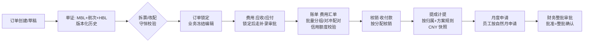
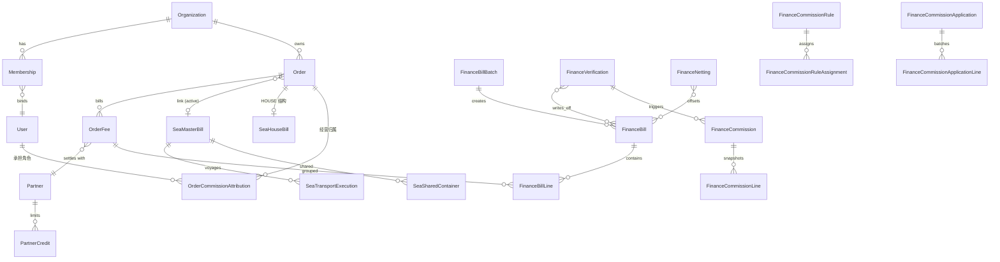

# 架构地图与核心数据流

> 面向新 AI 会话的系统导览。先读本文建立全局图景，再按任务域深入；
> 术语定义见 [glossary.md](./glossary.md)。

## 1. 技术栈与物理结构

```text
React 19 + Ant Design 6 (web/)          ←─ 同域部署 /api/* ─→   Go Kratos (server/)
  Vite 7 + React Router v8 集中式路由                            internal/service  传输层 DTO 转换与校验
  React Query 服务端状态                                         internal/biz      领域对象/用例/仓储接口/业务规则
  OpenAPI 生成客户端 (services/roncin)                           internal/data     Ent 仓储实现（PostgreSQL）
  权限来自 /auth/me（不复制第二套）                                internal/access   权限 Manifest 唯一真相源
```

- 契约单向流：`.proto` → 生成 Go 绑定 + `openapi.yaml` → 前端客户端。
  生成物禁止手改，变更走 `pnpm run generate:web-client`。
- 生产同域：Go 同时服务 `/api/*`、`/health/*` 与 React 静态资源。

## 2. 业务域地图（找代码先看这里）

| 域 | 后端 | 前端 |
| --- | --- | --- |
| 订单/海运单证 | `biz/sea_order_change.go`、`biz/sea_document_change.go`、`biz/sea_master_bill.go`、`data/sea_*` | `pages/orders/**`（品类模板 `pages/orders/templates/components/sea/`，注册表 `pages/orders/order-kinds/`） |
| 订单候选缓存 | `service/order_query.go` | `features/orders/options`（字典/首批港口机场/人员候选，组织切换清理入口） |
| 订单锁定 | `biz/order_lock.go`、`biz/order_auto_lock.go`、`data/order_lock_*.go` | `pages/orders`（锁状态条） |
| 费用/费用补录 | `service/settlement*.go`、`data/order_fee_supplement_*.go` | `pages/orders/fees.tsx`（建账工作台经 `features/finance/bill-creation`） |
| 账单/对冲/核销 | `biz/finance_bill*.go`、`data/finance_bill_*.go` | `pages/finance/{bills,fees,cashflows,verifications}/**`、`features/finance/{bill-creation,bill-status,credit-control,exchange-gain-loss}` |
| 提成（方案/台账/月度申请） | `biz/finance_commission*.go`、`data/finance_commission*.go` | `pages/finance/commissions/**`、`pages/workbench/**` |
| 往来单位 | `biz/partner*.go` | `pages/partners/**`、`features/partners`（候选搜索 `searchPartnerOptions`） |
| 主数据候选 | `biz/masterdata.go`、`biz/industry_reference.go` | `features/master-data/{currencies,shipping-lines}`、`pages/master-data/**`（通用类型 `types/select-option.ts`） |
| 业务标签 | `biz/business_tag.go` | `components/business-tag/`（列表渲染与分配弹窗） |
| 企业资源 | `biz/enterprise_resource.go` | `pages/enterprise-resources/**` |
| 组织/角色/权限 | `biz/admin_*.go`、`biz/auth.go` | `pages/admin/**` |
| 单据编号规则 | `biz/orderconfig.go` | `pages/admin/components/number-rules/` |
| 财务配置（汇率/费用目录） | `biz/exchange_rate*.go`、`biz/fee_catalog.go` | `pages/finance/exchange-rates/**`、`pages/finance/fee-settings/**` |
| 审计 | 审计事件独立存储 | `pages/admin/audit.tsx`、`features/audit`（业务页审计分区共用展示转换） |
| 工作台 | `biz/workbench.go` | `pages/workbench/**` |

## 3. 核心数据流：一张订单的财务一生



要点（改代码前必须理解的链路约束）：

1. **锁定的涟漪**：订单锁定后一切编辑路径冻结；费用只能补录（审批制），
   补录会产生提成冲减建议——改锁定/补录逻辑时两条链都要看。
2. **守恒不变量**：拆票与共享箱的件数/毛重/体积必须逐票守恒（前端实时校验 +
   服务端预览复核双层）；费用拆分按「方向+币种」守恒。
3. **版本乐观锁贯穿**：订单/账单/提成/申请全部 `expected_version` 校验，
   并发冲突统一 409 文案。
4. **不可变历史**：单证版本、变更事件、拆票/改配事件只追加；审计与业务事件
   分离存储。
5. **提成的完整候选 vs 工作台估算**：月度申请解析全量未申请来源（无分页上限），
   工作台展示是有界估算——两条路径不要混用（见
   `finance_commission_application_candidates.go`）。

## 4. 实体关系核心（简化）



（完整字段与索引以 `server/internal/data/ent/schema/` 为准；本图只表达导航级关系。）

## 5. 新 AI 会话上手路径

1. 读根目录 `AGENTS.md`（协作规范 + 命令）。
2. 读本目录 `glossary.md` + 本文，建立领域与模块图景。
3. 任务涉及其它层时读 `.trellis/spec/{server,web}/` 对应规范。
4. 用「§2 业务域地图」定位代码，用 `grep` 符号名直达实现。
5. 改动后按 AGENTS.md 分阶段验证命令跑最小检查。
