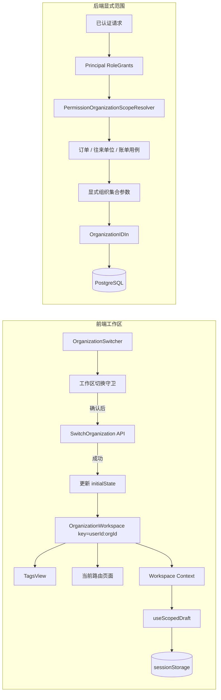

# 多组织快速上线薄底座 Design

## 1. 设计摘要

本设计以三个边界完成首批多组织能力：

1. 前端用 keyed workspace 同时隔离页签与页面；
2. 草稿通过 workspace context 自动取得用户和组织 scope；
3. 后端按“权限所在角色”解析组织集合，再由首批仓储显式过滤。

设计刻意不引入全局 Ent 拦截器。这样能够复用现有显式过滤方式，不改变认证、worker、
迁移工具和大批未纳入范围的仓储，降低首次上线的联动风险。

## 2. 总体结构



## 3. 前端设计

### 3.1 `OrganizationWorkspace`

在 `web/src/app.tsx` 中新增工作区边界，结构调整为：

```tsx
<AppFeedbackBridge />
<OrganizationWorkspace key={`${userId}:${organizationId}`}>
  <TagsView />
  <main className="roncin-layout-main">{children}</main>
</OrganizationWorkspace>
```

关键点：

- `TagsView` 必须放在 keyed workspace 内，不能只给页面容器加 key；
- key 同时包含用户和组织，避免同一浏览器会话切换账号时复用工作区；
- 无有效用户或组织时使用不持久化的匿名工作区，不拼造可碰撞的业务 scope；
- provider value 在单个工作区生命周期内保持稳定；
- 切换成功造成完整卸载，旧页签、页面组件 state 和 React ref 一并释放。

### 3.2 组织切换协调流程

`OrganizationSwitcher` 的处理顺序固定如下：

```text
选择目标组织
  -> 与当前组织相同：直接结束
  -> 调用 confirmBeforeWorkspaceSwitch()
     -> 取消：保持当前工作区
     -> 确认：锁定切换器并调用后端
        -> 失败：提示错误，解除锁定，保持当前工作区
        -> 成功：更新 initialState
                 -> history.replace('/welcome')
                 -> workspace key 变化并重建 TagsView + 页面
```

实现要求：

- 守卫复用现有 `tabCloseGuard` 的登记信息和草稿判断，不建立第二套 dirty 状态；
- 新增 workspace 级查询能力，能够判断当前 scope 是否存在脏页签或草稿；
- 同一次用户操作只出现一个确认框；
- 请求进行中禁用切换器，避免并发切换 A→B→C；
- 只有后端成功后才更新前端状态和路由；
- 跳转使用 `replace`，避免浏览器返回到旧组织详情 URL；
- 页面和页签清理由 keyed remount 完成，不在多个组件中分别广播 reset 事件。

### 3.3 Workspace Context

建议新增：

```ts
type OrganizationWorkspaceValue = {
  workspaceKey: string;
  userId?: string;
  organizationId?: string;
  draftScope?: string;
};
```

Context 只表达当前工作区身份，不放业务列表、表单数据或远程缓存。`draftScope` 仅在
用户和组织都有效时生成。

`useOrganizationWorkspace()` 在业务工作区外调用应抛出清晰开发错误；匿名登录壳层则
由 Provider 提供 `draftScope: undefined`，使草稿 Hook 退化为不持久化。

### 3.4 `useScopedDraft`

Hook 接收业务键，不接收用户或组织：

```ts
useScopedDraft({
  resource: 'order',
  recordKey: orderId ?? 'create',
  tabKey,
})
```

对外返回现有草稿能力所需的最小接口：`load`、`save`、`clear`、`hasDraft` 和稳定的
`draftKey`。内部存储键建议使用新版本前缀：

```text
roncin:form-draft:v2:{userId}:{organizationId}:{tabKey}:{resource}:{recordKey}
```

约束：

- 使用 `sessionStorage`，不改为长期保存；
- 不读取 v1 或无版本旧键；
- 序列化失败或 storage 不可用时走现有错误报告方式，不静默伪造成功；
- 提交成功只清当前完整 key；
- scope 缺失时不读写 storage；
- `OrderFormTemplate` 内部消费 Hook，并删除 `draftScope` prop；
- `TagsView` 通过同一个模块提供的 scope 查询能力判断草稿，不自行拼接键格式。

### 3.5 迟到响应与缓存

keyed workspace 能保证旧组件的渲染结果不会成为新组件 state，但不能取消已经执行的
Promise 回调。处理规则如下：

- 模块级缓存必须把 `organizationId` 作为 key 的一部分；
- 搜索请求保留序列号或取消机制，防止同一工作区内旧搜索覆盖新搜索；
- 快捷创建、保存等 mutation 保留发起时组织快照或 mounted/generation 校验；
- 旧工作区 mutation 完成后不得调用新工作区表单回填；
- 仅删除纯粹用于“组织变化时 setState 清空”的重复 effect/ref；
- 对 `PartnerQuickAddSelect` 等现有组件逐段判定，不能批量删除所有 ref。

## 4. 后端设计

### 4.1 数据模型

将订单专用模型替换为通用模型：

```text
Role
  └── RoleOrganizationAccess
        ├── role_id
        ├── organization_id
        └── writable
```

命名调整：

| 旧名称 | 新名称 |
| --- | --- |
| `RoleOrderOrganizationAccess` | `RoleOrganizationAccess` |
| `order_organization_accesses` | `organization_accesses` |
| 订单可访问组织 | 可访问组织 |

不提供旧字段别名、旧 DTO 兼容或双写。数据库迁移只形成一个新真相源。实施时优先选择
最简单且可审阅的单步迁移；不以保留旧开发数据为目标。若需要在本地执行清表、重建或
其他破坏性命令，必须先单独取得用户授权。

### 4.2 Principal 保留角色来源

新增或整理为等价结构：

```go
type RoleGrant struct {
    RoleID               uuid.UUID
    Permissions          map[string]struct{}
    DataScope            string
    OrganizationAccesses []RoleOrganizationAccess
}

type Principal struct {
    // 现有身份与当前组织字段
    RoleGrants []RoleGrant
}
```

可保留为性能或调用便利准备的派生集合，但授权解析必须以 `RoleGrants` 为真相，不能
把角色来源丢失后再做笛卡尔式合并。

`ResolvePrincipal` 一次加载当前成员关系对应的启用角色、权限、data scope 和通用
组织访问项。停用角色、停用组织和无效关联不进入 grant。

### 4.3 范围解析器

Biz 层新增 `PermissionOrganizationScopeResolver`（名称可按现有风格调整）：

```go
type PermissionOrganizationScope struct {
    ReadableOrganizationIDs []uuid.UUID
    WritableOrganizationIDs []uuid.UUID
}

Resolve(ctx context.Context, principal *Principal, permission string) (
    PermissionOrganizationScope,
    error,
)
```

解析器依赖最小组织目录接口：

- 列出全部启用组织 ID；
- 列出当前组织及启用后代组织 ID；
- 校验显式组织访问项指向启用组织。

每个包含目标权限的角色独立解析：

```text
organization      -> 当前组织
organization_tree -> 当前组织 + 启用后代
all               -> 全部启用组织
self              -> 当前组织（本人数据条件由业务域继续追加）

显式 accesses     -> 加入 readable
writable=true     -> 同时加入 writable
```

基础范围的写能力只有在该角色本身拥有对应写权限时才生效。实际调用以具体操作权限码
解析，例如订单查看使用 read 权限，订单修改使用 update 权限；不能用 read scope
推导 update scope。

结果去重并按 UUID 排序，便于稳定测试与日志。无匹配角色或结果为空时返回现有权限类
业务错误。

### 4.4 首批聚合接入

本阶段只修改三个聚合根：

| 聚合 | 读取路径 | 写入路径 | 必须保留的额外约束 |
| --- | --- | --- | --- |
| 订单 | 列表、详情 | 创建、编辑、状态流转 | 业务类型权限、版本与状态机 |
| 往来单位 | 列表、详情 | 创建、编辑 | 角色与组织唯一性、现有主数据规则 |
| 财务账单 | 列表、详情 | 创建、编辑、状态流转 | 账单状态、事务与并发控制 |

推荐调用链：

```text
Service 转换请求
  -> Biz 用例从 Principal + 本操作权限解析 scope
  -> 校验显式 organization_id（如有）
  -> Repository 方法接收 allowedOrganizationIDs
  -> Ent 查询显式追加 OrganizationIDIn(...)
```

细则：

- Service 不自行查询 Ent，也不重新实现范围算法；
- Biz 决定当前动作对应的权限码、读写模式和目标组织校验；
- Data 只使用 Biz 传入的组织集合构造谓词；
- 详情和修改不能先按 ID 查询再在内存判断，应在查询谓词中包含组织范围；
- 多组织列表为空是正常结果；显式请求范围外组织、详情或写入返回权限错误；
- 订单业务类型权限继续作为独立条件与组织范围求交集；
- 账单事务继续遵循 `biz.Transactor`、`Data.client(ctx)` 和现有并发规范。

### 4.5 角色管理契约与页面

修改 `server/api/admin/v1/admin.proto` 的角色请求与响应，把订单专用字段一次性替换为
通用 `organization_accesses`。随后通过仓库生成命令更新 Go、OpenAPI 与 Web 客户端。

角色页面保持当前交互骨架，文案和字段改为通用组织范围：

- 显示角色 `data_scope`；
- 配置追加的可访问组织；
- 对每个追加组织配置 `writable`；
- 保存时只提交新字段；
- 权限不足时沿用现有角色管理授权，不新增前端自定义权限真相。

### 4.6 为什么本阶段不使用 Ent 拦截器

全局拦截器需要同时解决：

- 哪些实体直接含组织字段、哪些通过父表隔离；
- 认证解析本身如何查询组织与角色；
- worker、迁移、同步工具如何显式进入系统范围；
- 查询、创建、更新、删除的不同 Hook 语义；
- 管理面跨组织接口和业务面跨组织接口如何区分；
- 事务 client 是否始终携带正确上下文。

这些工作不是首批三聚合上线的必要条件。继续使用显式仓储谓词，虽然不是最终的全局
兜底，但影响面清晰、容易定向验证，也不需要为系统路径增加豁免协议。

## 5. 错误语义

- 目标组织不在可读/可写集合：使用现有权限拒绝业务错误，对外 HTTP 403；
- 资源 ID 存在但不在允许组织：不返回资源内容；若现有接口统一映射为 403，保持 403；
- 组织已停用：不进入解析集合；
- 无包含目标权限的角色：权限拒绝；
- 切换组织后端失败：前端保留原工作区并展示统一请求错误；
- 草稿存储不可用：不阻断表单编辑和提交，但必须按现有前端错误渠道可观察，不能提示
  “已保存草稿”。

## 6. 数据与生成策略

按仓库生成约束执行：

1. 修改 Ent Schema 与 `.proto` 真相源；
2. 生成并审阅 Ent / Proto 代码及数据库迁移；
3. 运行 `pnpm run generate:web-client`；
4. 更新服务端、前端调用方；
5. 将源文件、迁移和生成物放入同一可审阅提交。

不手改生成文件，不保留旧接口适配层。迁移的目标是新代码能在新模型上运行，不承诺
旧开发数据继续可用。

## 7. 验证设计

### 7.1 前端定向验证

- `OrganizationSwitcher`：相同组织、取消、失败、成功、重复点击；
- `OrganizationWorkspace`：用户或组织变化时 TagsView 与页面一同重挂载；
- 草稿：按用户/组织/页签隔离、恢复、提交清理、旧 key 不读取；
- 迟到响应：旧组织搜索/创建完成后不回填新工作区；
- 角色表单：新字段展示、编辑、保存及 `writable`。

### 7.2 后端定向验证

- 同一用户拥有多个角色时，权限范围不跨角色串联；
- 四种 `data_scope` 的组织集合；
- 显式追加组织的 read/write 差异；
- 停用角色、停用组织和空结果；
- 订单业务类型权限与组织范围同时生效；
- 订单、往来单位、账单的列表、详情、创建、更新和状态流转越界场景；
- 账单事务和版本冲突回归；
- 角色契约转换与提权校验回归。

### 7.3 最终验证

开发阶段每组修改只运行相关测试、修改文件 Biome、`git diff --check`，按类型影响运行
前端 `tsc`。契约和跨层阶段完成后运行服务端检查与前端门禁；整个任务最终验收时只再
执行一次风险匹配的完整检查，不在每轮改动后反复跑全量套件。

## 8. 回滚与延期策略

- 每个 Phase 独立提交，前端工作区、草稿和后端授权模型可分别审阅；
- 若 Phase 3 体量超出发布窗口，可先交付 Phase 1 + Phase 2，并保持现有单组织仓储
  行为；不得提交一半新契约、一半旧调用方；
- Phase 3 一旦修改 Proto/Schema，必须以原子阶段完成生成物和仓库内调用方切换；
- 不通过恢复旧字段或双读来回滚，回滚使用 Git 提交级回退和开发数据库重新迁移；
- 未来扩展更多聚合时复用 resolver 和显式仓储参数，不自动升级为全局拦截器。
