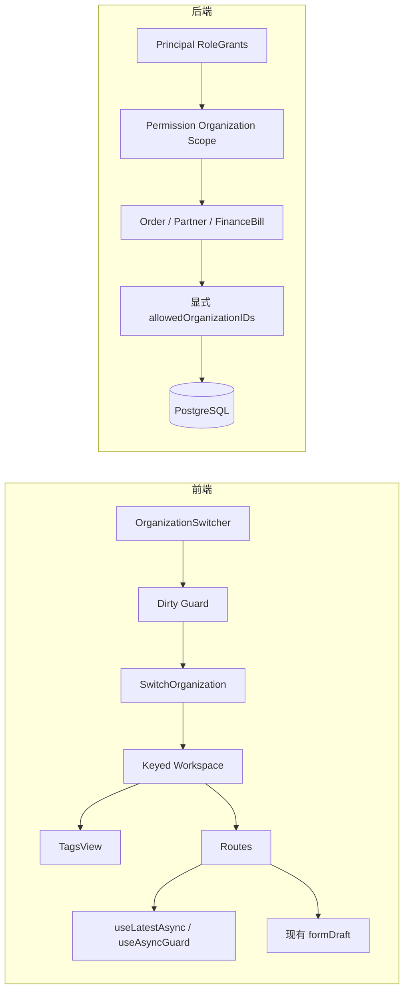

# 多组织快速上线薄底座 Design

## 1. 架构边界

本设计只增加三项公共能力：

1. keyed organization workspace，负责真实组织切换时重建页签与页面；
2. 通用异步守卫，负责查询 latest-wins 和卸载后的副作用失效；
3. permission organization scope resolver，负责按权限所在角色计算组织集合。

草稿继续使用现有 `formDraft.ts`，数据查询继续使用显式仓储谓词。



## 2. 前端工作区

### 2.1 挂载结构

`web/src/app.tsx` 调整为同一个 keyed 容器包住页签和页面：

```tsx
<AppFeedbackBridge />
<div key={`${userId}:${organizationId}`} className="roncin-organization-workspace">
  <TagsView />
  <main className="roncin-layout-main">{children}</main>
</div>
```

不强制新增 Context。当前需求只需要 React 生命周期边界，用户与组织仍从
`@@initialState` 获取。

key 包含用户与组织，保证切换账号或组织都会卸载旧工作区。`TagsView` 必须位于 key
内部，否则页面虽然重建，旧组织页签仍会保留。

### 2.2 切换流程

```text
选择组织
  -> 相同组织：结束
  -> 检查已注册 dirty guard
     -> 取消：结束
     -> 确认：锁定 Select，调用后端
        -> 失败：保留旧 initialState、路由和页签
        -> 成功：更新 initialState
                 -> history.replace('/welcome')
                 -> key 变化，卸载旧工作区
```

`tabCloseGuard` 增加“是否存在任意已注册脏表单”与统一确认函数即可。已经写入
`sessionStorage` 的草稿不会因切换丢失，因此无需扫描和迁移全部草稿；确认主要覆盖尚未
完成自动保存的当前编辑状态。

## 3. 通用异步守卫

### 3.1 为什么不能只依赖 workspace key

组件卸载后 React 不再渲染其 state，但已有 Promise 仍可能继续：

- 调用传入的 `onSuccess`；
- 回填外部 form ref；
- 写入模块级缓存；
- 跳转路由；
- 弹出成功消息；
- 触发另一个请求。

因此 workspace 负责“销毁视图状态”，异步守卫负责“禁止过期副作用”。

### 3.2 Hook 契约

建议提供两个薄封装，底层共享 token/abort 实现：

```ts
type AsyncRunContext = {
  signal: AbortSignal;
};

type GuardedResult =
  | { current: true }
  | { current: false; reason: 'stale' | 'unmounted' | 'aborted' };

function useLatestAsync(): {
  run<T>(
    request: (ctx: AsyncRunContext) => Promise<T>,
    apply: (value: T) => void,
  ): Promise<GuardedResult>;
  cancel(): void;
};

function useAsyncGuard(): {
  run<T>(
    request: (ctx: AsyncRunContext) => Promise<T>,
    apply: (value: T) => void,
  ): Promise<GuardedResult>;
  invalidate(): void;
};
```

语义区别：

- `useLatestAsync`：每次 `run` 都令同一个 Hook 的上一次 token 失效，适合搜索、联想、
  切换筛选条件；
- `useAsyncGuard`：只保证卸载或显式 invalidate 后不执行后续副作用，适合保存、创建；
  写请求本身仍由页面的 loading 状态禁止重复提交。

### 3.3 实现规则

内部维护：

- 单调递增 sequence；
- 当前 `AbortController`；
- mounted 状态；
- cleanup 时 sequence 增加并 abort。

`run` 的处理顺序：

1. 生成 token；
2. latest 模式先使旧 token 失效并 abort 旧请求；
3. 调用 request；
4. request 成功后检查 mounted 与 token；
5. 只有 token 仍有效时才由 Hook 调用 `apply`，页面不能在 request 函数中夹带回填副作用；
6. 当前请求的业务错误原样抛出；
7. 仅把明确的 stale/abort 归为非当前结果，不吞掉 400/403/500。

业务调用示例：

```ts
const latestSearch = useLatestAsync();

const loadOptions = (keyword: string) =>
  latestSearch.run(
    ({ signal }) => queryPartners({ keyword }, { signal }),
    (result) => setOptions(result),
  );
```

优先使用由 Hook 包住 `apply` 的形式，而不是让页面拿到原始结果后自行判断
`result.current`；这样调用方不会因为漏写一次判断而重新引入竞态。返回状态只用于调用方
记录请求是否已应用，不携带过期的原始响应。

`apply` 必须是同步 UI 副作用，不允许在其中继续 `await`。若当前结果触发下一次远程请求，
下一段请求必须重新进入 guarded run；否则组件可能在异步 `apply` 中途卸载。

对于 ProForm/ProSelect 等自行消费 Promise 返回值的组件，不能把 stale 结果返回为空数组
后任其覆盖新选项。应由受控 `options` state 应用当前结果，或使用组件已验证的 request
竞态能力；实施时通过测试确认具体行为。

### 3.4 不能删除的保护

- 模块级缓存的 organization key；
- mutation 的 loading/幂等控制；
- 服务端权限与目标组织校验；
- 事务、版本和状态机；
- 不能接收 `AbortSignal` 的 API 所需的 token 检查；
- 同一工作区内由业务 ID 变化产生的资源身份检查。

仅删除与 Hook 完全等价的 sequence、mounted ref，以及被 keyed workspace 取代的
“组织变化时手动清空本地 state”代码。

## 4. 草稿保持现状

不新增草稿 Context 或 Hook。继续使用：

```text
getFormDraftScope(userId, organizationId)
getFormDraftKey(tabKey, pathname, draftScope)
sessionStorage
```

真实组织切换后，页面重挂载并按新的 `initialState` 生成新 scope；切回原组织后使用原
scope 恢复草稿。天津工作区跨组织只读查看北京订单不会改变当前组织，不产生北京编辑
草稿，也不要求改变 key 语义。

## 5. 后端权限组织范围

### 5.1 通用模型

```text
Role
  └── RoleOrganizationAccess
        ├── role_id
        ├── organization_id
        └── writable
```

旧 `RoleOrderOrganizationAccess` 与 Proto 字段 `order_organization_accesses` 一次性替换
为通用名称，不保留别名或双写。

### 5.2 Principal 必须保留角色来源

```go
type RoleGrant struct {
    RoleID               uuid.UUID
    Permissions          map[string]struct{}
    DataScope            string
    OrganizationAccesses []RoleOrganizationAccess
}
```

授权解析以 `RoleGrants` 为真相，禁止先把 permissions 与 organization accesses 分别
合并后再判断。

### 5.3 Resolver

```go
type PermissionOrganizationScope struct {
    ReadableOrganizationIDs []uuid.UUID
    WritableOrganizationIDs []uuid.UUID
}
```

针对一个具体权限码：

1. 找出拥有该权限的启用角色；
2. `organization` 得到当前组织；
3. `organization_tree` 得到当前组织与启用后代；
4. `all` 得到全部启用组织；
5. `self` 在组织层面得到当前组织；
6. 显式 access 加入 readable，`writable=true` 时加入 writable；
7. 多角色结果取并集、去重并稳定排序。

读取动作使用自身 read 权限解析 readable；写动作使用具体 create/update/status 权限解析
writable。不能使用 read scope 推导 update scope。

### 5.4 首批仓储

订单、往来单位、财务账单的 Biz 用例取得 scope，Data 仓储接收明确的
`allowedOrganizationIDs` 并在 SQL/Ent 谓词中应用。详情与写入查询同时约束主键和组织
集合，不能先全局查出实体再在内存判断。

订单业务类型权限继续与组织集合求交集；账单继续遵守 `biz.Transactor`、
`Data.client(ctx)`、锁顺序与 expectedVersion。

## 6. 迁移与生成

1. 修改 Ent Schema 与 Proto 真相源；
2. 生成 Ent、Proto 和数据库迁移；
3. 运行 `pnpm run generate:web-client`；
4. 原子更新服务端与前端调用方；
5. 不手改生成物，不增加旧字段适配器。

不承诺保留旧开发数据。若实施需要清空或重建本地数据库，执行前仍需用户明确授权。

## 7. 验证重点

- keyed workspace 同时卸载 TagsView 与页面；
- 切换取消、失败、成功和重复触发；
- latest query 只应用最后结果；
- 卸载后 mutation 不回填、不跳转、不写缓存；
- 当前业务错误不被 stale 处理吞掉；
- 现有草稿跨组织隔离和切回恢复；
- 天津角色追加北京只读范围；
- 不同角色的权限与范围不串联；
- 四种 data scope、停用组织与 writable；
- 三个聚合的列表、详情、写入显式过滤；
- 订单业务类型权限和账单事务并发回归。

## 8. 取舍

这套方案不能自动保护尚未接入的全部业务域，也不能撤销服务端已执行的异步写入；它的
价值是以很小的公共能力消除重复前端样板，并让首批跨组织授权具有统一、可测试的算法。
全局 ORM 拦截和系统上下文在进入生产数据阶段后再单独评估。
