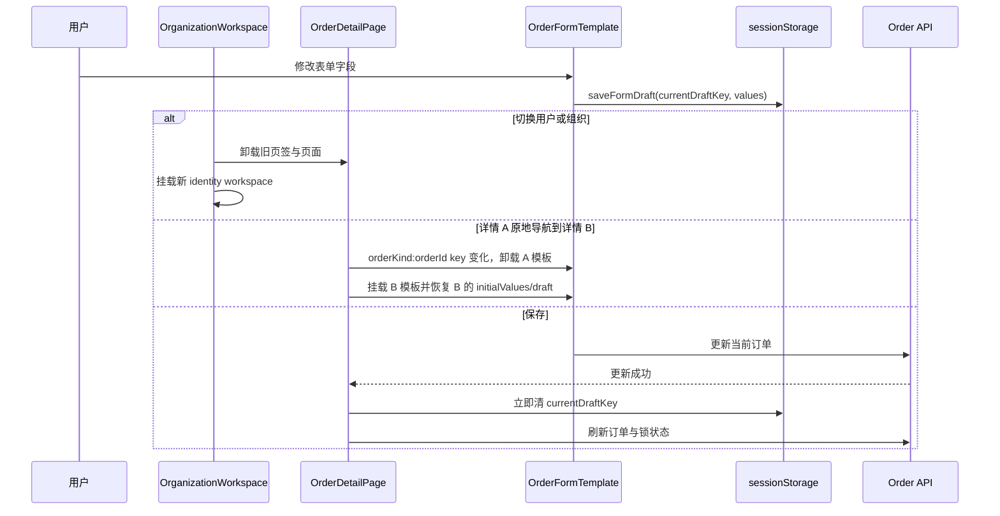

# 清理订单草稿冗余防御代码 Design

## 1. 设计摘要

本设计不把“有工作区 key”解释成“所有草稿保护都可删除”，而是把身份重建职责上移到
正确边界：用户/组织身份由 `OrganizationWorkspace` 管理，详情业务类型/记录身份由
`OrderDetailPage` 管理，`OrderFormTemplate` 只负责当前稳定身份下的草稿读写与关闭守卫。

这样可以删除模板内部重复的身份探测和第二层 `<ProForm>` key，同时保留保存成功、刷新、
重置、只读和持久命名空间各自不可替代的语义。

## 2. 身份边界与不变量

### 2.1 双层挂载身份

```text
OrganizationWorkspace key = userId:organizationId
  └── OrderDetailPage
        └── OrderFormTemplate key = orderKind:orderId
              └── ProForm（不再设置 draftKey key）
```

- `OrganizationWorkspace` 变化时，页签和页面整体卸载，处理用户/组织身份变化；
- 详情页的 `${config.kind}:${orderId}` 变化时，模板整体卸载，处理业务类型/记录变化；
- 一个 `OrderFormTemplate` 实例存活期间，`draftScope`、`resolvedTabKey` 和 pathname 必须
  保持同一草稿身份；模板不再自行侦测调用方违反该契约。

详情 key 不只使用 `orderId`：即使当前订单 ID 全局唯一，将业务类型纳入 key 也能与路由和
草稿 pathname 的身份定义保持一致，不依赖“同一个 ID 不会出现在其他 kind”这一额外假设。

### 2.2 新建页事实

实际路由虽然是 `/orders/:kind/new`，但当前 `ORDER_KIND_CONFIGS` 只接受 `sea-export`，
`air-export`、`air-import`、`sea-import` 都会进入无效业务类型分支。因此当前有效的新建页
实例中，kind/pathname 不会在两个有效业务类型之间变化；组织变化又会卸载整个工作区，
本任务无需修改 `new.tsx`。

未来增加第二种有效订单类型时，新增类型任务必须给新建模板增加业务类型级父 key，或通过
路由测试证明旧模板一定卸载。通用模板不恢复 props 变化侦测。

## 3. 详细改造方案

### 3.1 `OrderFormTemplate.tsx`

删除：

1. `previousDraftKeyRef = useRef(draftKey)`；
2. `draftContextChanged` 比对及由它触发的 dirty 重置；
3. `<ProForm<T> key={draftKey}>` 的内部动态 key。

保留：

1. 非只读、有 `draftKey`、非 loading 时读取并恢复有效草稿；
2. `useTabCloseGuard`；
3. `onValuesChange` 时的 dirty 更新与 `saveFormDraft`；
4. 原生 `onReset` 时清草稿、清 dirty；
5. `onFinish` 返回非 `false` 时清草稿、清 dirty；
6. 提交 loading，避免重复提交。

草稿恢复 effect 旁补充注释，明确 draft identity 在模板挂载期内恒定，身份变化由上层 key
负责。不能写成“只在首次挂载执行”，因为 loading 或 readonly 在同一记录内变化时，该
effect 仍可能合法地重新判断是否恢复草稿。

### 3.2 `detail.tsx`

定义稳定的详情表单身份：

```tsx
const orderFormIdentity =
  config && orderId ? `${config.kind}:${orderId}` : undefined;
```

- 原来依赖 `[draftScope, orderId]` 的资源清理 effect 改为依赖 `orderFormIdentity`；
- `OrderFormTemplate` 使用 `key={orderFormIdentity}`；
- 删除传给模板的 `onReset` 回调，因为模板已经在调用页面回调前清除同一个 `draftKey` 并
  重置 dirty；
- 不引入新的清理 helper：剩余三个清理点属于不同业务时序，合并只会隐藏语义。

### 3.3 草稿清理职责矩阵

| 场景 | 责任位置 | 清理时机 | 失败语义 |
| --- | --- | --- | --- |
| 原生“重置表单” | `OrderFormTemplate` | ProForm reset 时 | 同步清当前 draft |
| 底部“重置修改” | `detail.tsx` footer | 回填服务端 initialValues 前 | 显式用户动作，清当前 draft |
| 菜单“刷新数据” | `detail.tsx` 显式刷新 effect | `loadData` 完成并取得当前 order 后 | 加载失败保留 draft |
| 保存订单 | `detail.tsx` | 更新接口成功后、后续刷新前 | 更新失败保留；更新成功后刷新失败也必须已清理 |
| 通用成功提交 | `OrderFormTemplate` | `onFinish` 返回非 `false` 后 | `false` 时保留 draft |

保存路径看似与模板成功提交重复，但当前 `handleSaveEdit` 把保存后的 `loadData` 和锁状态刷新
也放在同一个 `try` 中。如果更新已成功而后续刷新失败，它会返回 `false`；此时仅依赖模板
清理会错误保留旧草稿。因此本任务必须保留详情页“更新接口成功后立即清理”的防线。

### 3.4 只读转换语义

- 初次以 `effectiveReadonly=true` 挂载时，不读取持久草稿；
- 无编辑权限与业务锁单都必须使模板和分节使用同一个只读值；
- 同一订单在后台同步锁状态时，不以 readonly/initialValues 的变化重置用户已开始编辑的
  内存表单；该行为继续由 `pendingExplicitFormRefreshRef` 区分显式刷新和后台同步；
- 显式刷新只有在当前加载完成并取得 order 后才清草稿、回填服务端值。

## 4. 数据流与时序



## 5. 验证设计

1. `OrderFormTemplate.test.tsx`：保留保存、恢复、重置、dirty 和关闭守卫测试；将“同实例
   切换 `draftScope`”替换为只读不读草稿、成功提交清草稿等真实职责测试。
2. 详情草稿生命周期测试：通过 mock 内可观测的实例 ID 与 mount/unmount 记录（或直接渲染
   轻量真实模板）证明 A→B 原地导航确实重挂载模板，不能只断言 B 最终字段值；同时验证
   保存成功后刷新失败仍清草稿、更新失败和显式刷新失败保留草稿、底部重置只清当前记录。
3. `detail-change-actions.test.tsx`：继续证明后台锁状态同步不覆盖未保存内存值，显式刷新在
   最新加载完成后才回填。
4. `app.test.tsx`：继续证明用户/组织变化会同时卸载页签和页面。
5. `formDraft.test.ts` 与 `TagsView.test.tsx`：继续证明用户/组织命名空间隔离和关闭页签清理。
6. 修改文件运行 Biome，运行 TypeScript；由于改动公共订单模板，任务最终执行一次
   `pnpm run check:web`。

## 6. 回滚

本任务不修改持久数据格式、后端契约或数据库。若验收发现表单身份或草稿生命周期回归，
整体回退本任务的单个重构提交即可；不得通过恢复旧字段兼容或清空 `sessionStorage` 规避。
