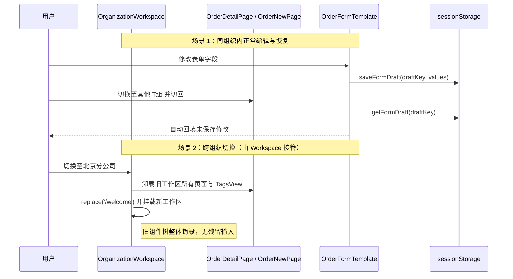

# 清理订单草稿冗余防御代码 Design

## 1. 设计摘要

在 `<OrganizationWorkspace key={`${userId}:${organizationId}`}>` 统管工作区生命周期后，前端页面组件的挂载/卸载已经与组织身份完全绑定。本设计通过精简 `detail.tsx` 与 `OrderFormTemplate.tsx` 中的防御性补丁代码，消除双重重挂载与多余监听，同时确保同组织内的正常草稿防手抖与多页签守卫不受任何影响。

## 2. 详细改造方案

### 2.1 `OrderFormTemplate.tsx` 改造

#### 移除项：
1. 删除 `previousDraftKeyRef = useRef(draftKey)`；
2. 删除 `draftContextChanged` 相关比对及 `setInternalDirty(false)` 重置逻辑；
3. 将 `<ProForm<T> key={draftKey} ...>` 恢复为普通 `<ProForm<T> ...>`。

#### 保留项：
1. 首次挂载时的草稿恢复逻辑（仅当 `!readonly && draftKey && !loading` 且存在有效草稿时 `setFieldsValue`）；
2. `useTabCloseGuard` 页签未保存检查；
3. `onValuesChange` 触发时的 `saveFormDraft`；
4. `onReset` 与提交成功时的 `clearFormDraft`。

### 2.2 `detail.tsx` 改造

#### 移除项：
1. 将 `useEffect(() => { setIsFormDirty(false); }, [draftScope, orderId]);` 改为：
   ```tsx
   useEffect(() => {
     setIsFormDirty(false);
   }, [orderId]);
   ```
   不再将 `draftScope` 作为脏状态重置的依赖。

#### 收敛项：
1. 收敛 4 处分散的 `if (draftKey) clearFormDraft(draftKey);`，统一由清理辅助函数或表单生命周期接管，保持逻辑清爽；
2. 收敛时保留 `pendingExplicitFormRefreshRef` 的时序语义（`loadData` 完成后再执行清草稿与回填，避免锁状态刷新抢先清掉用户正在编辑的内容），不得把显式刷新重置简化成即时执行。

### 2.3 不变量声明与影响面

- **draftKey 挂载期恒定不变量**：`key={draftKey}` 移除后的安全性依赖三条前提——组织切换由 `OrganizationWorkspace`（key 绑定 userId:organizationId）整体卸载；同页签跨订单导航必经路由切换（列表页中转），`detail.tsx` 组件重挂载；当前不存在「详情 A 原地跳转详情 B」的链接。为避免该前提退化为「碰巧成立」，在 `detail.tsx` 渲染 `OrderFormTemplate` 处补充 `key={orderId}`：行为与现状完全一致，但把记录级身份重挂载从表单内部上移到页面结构层兜底。
- `OrderFormTemplate` 草稿恢复 effect 处补充注释：「draftKey 视为挂载期内恒定；身份/记录切换由工作区与页面级 key 保证」。
- **`new.tsx` 影响结论**：新建订单页同为 `OrderFormTemplate` 调用方，受 `key={draftKey}` 移除影响的分析结论为**无行为变化**——`/orders/new` 的 pathname 恒定，同一组织内 draftKey 不变；组织切换由工作区卸载兜底。本任务不改动 `new.tsx`。
- **规范同步**：实施时同步改写 `.trellis/spec/web/frontend/state-management.md` 第 3 节「身份命名空间变化时表单必须重新挂载」与第 6 节「模板测试：在同一个组件实例切换 draftScope」两条，改为工作区级重挂载描述。

## 3. 数据流与时序保证



## 4. 验证设计

1. **定向单测**：
   - 运行 `OrderFormTemplate.test.tsx`、`detail-change-actions.test.tsx`、`TagsView.test.tsx`；
   - 针对 `OrderFormTemplate`，清理掉测试中手动通过 props 变更 `draftScope` 强行期望 `resetFields` 的非真实场景用例（真实场景组件会被整体卸载）。
2. **规范一致性**：`state-management.md` 已改写为工作区级重挂载契约；`detail.tsx` 的 `key={orderId}` 与模板「draftKey 挂载期恒定」注释就位。
3. **代码门禁**：
   - `pnpm --dir web exec biome lint`
   - `pnpm --dir web tsc`
   - `git diff --check`
