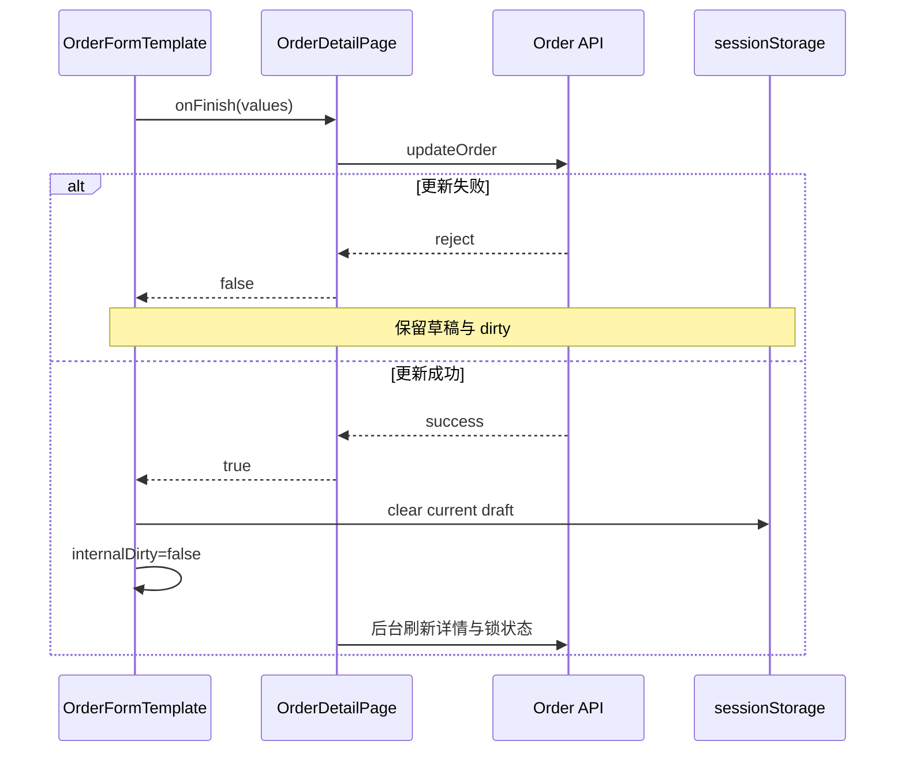

# 收拢订单模板草稿生命周期 Design

## 1. 设计摘要

以“模板拥有草稿生命周期、页面只提供业务身份与命令”为唯一边界，合并解决双重
`draftKey`、受控 dirty、重复清理和保存/刷新混杂问题。

```text
OrganizationWorkspace key = userId:organizationId
  └── OrderDetailPage
        └── OrderFormTemplate key = orderKind:orderId
              ├── draft identity = tabKey + draftPathname + draftScope
              ├── draftKey（仅模板计算）
              ├── internalDirty + useTabCloseGuard
              └── actionsRef.resetTo(values)
```

身份变化仍通过 React key 卸载重建，不在模板中恢复多身份侦测。当前项目快速上线且未上线，
不为旧 props、旧调用方式或历史草稿键增加兼容层。

## 2. 公共接口

### 2.1 Props

`OrderFormTemplateProps<T>` 调整为：

```ts
export interface OrderFormTemplateActions<T> {
  resetTo: (values?: Partial<T>) => void;
}

export interface OrderFormTemplateProps<T> {
  // 既有业务 props 省略
  tabKey?: string;
  draftPathname?: string;
  draftScope?: string;
  actionsRef?: React.MutableRefObject<
    OrderFormTemplateActions<T> | undefined
  >;
}
```

删除：

```ts
dirty?: boolean;
onDirtyChange?: (dirty: boolean) => void;
```

`tabKey` 不再带“缺失时从当前路由猜测”的语义。任一草稿身份输入缺失时，模板不生成
`draftKey`、不读写持久草稿；实时 guard 也只有在有显式 `tabKey` 时注册到目标页签。

### 2.2 `resetTo` 契约

模板通过 `useImperativeHandle(actionsRef, ...)` 暴露动作，但不把自定义方法写入
`ProFormInstance`：

```ts
resetTo(values) {
  clear current draft;
  form.resetFields();
  if (values) form.setFieldsValue(values);
  setInternalDirty(false);
}
```

先 `resetFields()` 是为了清除当前 Form store 中服务端新值已不存在的字段，再回填调用方
提供的最新快照。动作只操作当前模板闭包中的 `draftKey`，不会扫描同页签其他草稿。

## 3. 草稿恢复设计

模板在挂载期使用稳定的 `draftKey`。增加“本身份是否已经尝试恢复”的 ref，并通过
`useLayoutEffect` 执行：

```text
loading=true 或 readonly=true
  └── 等待，不标记已尝试

loading=false、readonly=false，但没有完整 draft identity
  └── 继续等待，不标记已尝试

首次 loading=false、readonly=false 且身份完整
  ├── 标记本身份已尝试
  ├── 没有有效草稿：结束
  └── setFieldsValue(draft) + internalDirty=true

同身份后续 readonly/loading 往返
  └── 不再恢复，不覆盖当前内存表单
```

`useLayoutEffect` 在浏览器绘制前回填，避免普通 effect 造成的服务端值 → 草稿值可见跳变；
不引入浅合并或深合并。初始或始终只读的页面不读取草稿，首次变为可编辑时仍可恢复。

## 4. 详情页数据流

### 4.1 显式刷新

现有无身份布尔 ref 改为保存请求时的 `orderFormIdentity`：

```text
用户在 A 点击刷新
  ├── capture requestedIdentity=A
  ├── await loadData()
  └── 记录 pendingIdentity=A 并触发刷新完成版本

刷新完成 effect
  ├── pendingIdentity !== currentIdentity → 丢弃并清 pending
  ├── 当前 order 不存在 → 保留草稿与 dirty
  └── 当前 order 存在 → actionsRef.resetTo(initialValues)
```

这样既等待 React 使用最新服务端响应重算 `initialValues`，也不会让 A 的迟到完成调用已经
指向 B 模板的 actions ref。

### 4.2 保存



后台刷新使用现有 Hook 的业务身份和请求序号保护。普通请求错误继续由 Hook 呈现；仅未知
reject 在页面补充一次“已保存但刷新失败”的兜底提示。

## 5. 新建页数据流

新建页显式传入：

```ts
tabKey={resolveTabKey(`/orders/${config.kind}/new`)}
draftPathname={`/orders/${config.kind}/new`}
draftScope={draftScope}
```

创建成功仍由模板根据 `onFinish` 返回 `true` 清草稿。当前只有 `sea-export` 有效，不在本任务
为尚未开放的 kind 增加额外身份兼容。

## 6. 变更矩阵

| 场景 | 变更后唯一责任方 | 失败行为 |
| --- | --- | --- |
| 字段变化保存草稿 | 模板 | 存储异常不阻断输入 |
| 恢复草稿 | 模板首次可编辑 layout effect | 非法或缺失草稿按服务端初始值 |
| 原生重置 | 模板 | 同步清当前草稿与 dirty |
| 底部重置修改 | 页面发命令，模板执行 | 只重置当前身份 |
| 显式刷新 | 页面校验身份，模板执行 resetTo | 失败保留草稿、值和 dirty |
| 保存成功 | 模板 | 后台刷新失败不反转成功 |
| 页签/组织切换确认 | 模板 internal dirty + 现有 guard | 取消时保留工作区 |

## 7. 回滚与兼容

- 不改 `sessionStorage` 键格式与内容格式，无数据迁移；
- 不保留旧 `dirty/onDirtyChange` props 或 window pathname fallback；
- 若验收失败，整体回退本任务提交；不得通过清空用户 sessionStorage 掩盖问题；
- 本任务不修改后端或生成物。
