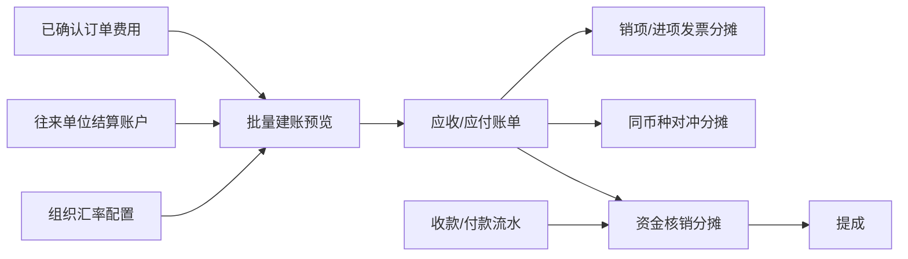

# 财务模块上线收口技术设计

## 1. 设计目标与边界

本设计在现有“费用 → 账单 → 发票/资金 → 核销 → 提成”架构内补齐上线闭环，
不引入总账、会计凭证、事件总线、工作流引擎或通用财务规则 DSL。

核心原则：

1. 账单、发票、资金流水、核销、对冲分别保存自己的金额与汇率事实；
2. 服务端负责分组、金额、权限、状态与并发真相，前端只提交选择和明确配置；
3. 现有预览令牌、幂等键、版本号、Decimal、事务和稳定加锁顺序继续复用；
4. 当前项目未上线，不增加历史字段兼容、双写或旧流程 fallback；
5. 所有跨组织能力由权限码的数据范围解析，不判断角色名称或当前公司名称。



## 2. 领域模型调整

### 2.1 往来单位结算账户

现有 `PartnerAccount` 从 `PartnerRole` 子资源调整为 `Partner` 子资源。账户属于法律主体，
客户、供应商、国外代理角色不再决定账户所有权。

建议字段：

| 字段 | 说明 |
|---|---|
| `partner_id` | 账户所属往来单位 |
| `name` / `account_holder` | 账户名称和户名 |
| `bank_name` / `account_no` | 开户行与账号 |
| `currency` | 账户币种 |
| `swift_code` | 国际账户可选 |
| `usage` | `RECEIVABLE`、`PAYABLE`、`BOTH` |
| `is_default_receivable` | 该单位、币种下默认应收账户 |
| `is_default_payable` | 该单位、币种下默认应付账户 |
| `enabled` | 是否可用于新账单 |

数据库唯一约束保证同一往来单位、币种和用途最多一个默认账户。若 Ent 无法直接表达带条件
唯一索引，则使用两个明确默认字段并在事务内锁定同单位同币种账户后切换默认值，同时由迁移
中的部分唯一索引兜底。

账单保存账户引用及不可变快照。草稿修改账户时更新快照；确认后禁止修改。来源账户以后改名、
停用或删除，不反写既有账单。

账户方向适用性只由 `usage` 判断。账单方向来自已选费用事实，不再要求往来单位必须同时具有
某个客户、供应商或国外代理角色；这些业务角色既不决定账户所有权，也不额外限制应收、应付
账户候选。

账户主数据页面继续分别使用 `business.partner.account.read/create/update`。建账工作台中的账户
候选不是主数据浏览能力：创建候选必须按 `finance.bill.create` 的可写组织范围解析，草稿改选
候选必须按 `finance.bill.update` 的可写组织范围解析。候选接口不接受客户端传入权限码；服务端
根据固定用途选择最终动作权限，返回指定组织、结算单位、方向和币种下的启用账户。创建与更新
事务仍需重读账户并校验归属、用途、币种和状态，不能信任候选结果或前端上下文。

### 2.2 账单金额与折算明细

每张 `FinanceBill` 仍只有一个 `currency`，其含义改为最终账单币种。`base_currency` 和
`base_currency_amount` 仍是组织本位币快照。

`FinanceBillLine` 补齐以下账单折算事实：

- 费用原币与原币含税/未税/税额；
- 最终账单币种与折算后的含税/未税/税额；
- 账单折算汇率、来源、日期、设置 ID；
- 系统建议汇率；人工调整时的原因、操作者和时间。

同一叶子中相同“费用原币 → 账单币种”组合只解析或覆盖一次汇率，再应用到全部对应费用。
Decimal 统一由服务端计算；最后一条明细吸收确定性舍入尾差，使明细总和严格等于账单头。

账单上的预计开票币种、预计开票汇率和预计开票金额另存为预估字段，不参与账单余额计算，
也不约束真实发票。

### 2.3 发票分摊

保留 `FinanceInvoice` 作为发票头，将现有整账单关联升级为以账单明细为来源的有效分摊：

```text
FinanceInvoice
  └── FinanceInvoiceAllocation
        ├── invoice_id
        ├── bill_id / bill_line_id / order_fee_id
        ├── allocated_total_amount
        ├── allocated_net_amount
        ├── allocated_tax_amount
        ├── tax_rate snapshot
        └── active / invalidated metadata
```

可复用并扩展现有 `FinanceInvoiceBill` / `FinanceInvoiceLine` 时不额外制造同义表；实施前以现有
读写路径为准选择最小迁移。旧“一个有效发票占用整张账单”的唯一约束直接移除，不保留兼容路径。

创建或确认发票的事务按 `bill_id`、`bill_line_id` 稳定排序后加锁，重新汇总有效分摊余额。
并发争抢最后余额时一个成功、其余返回冲突。取消、作废和红冲通过使原分摊失效恢复可开余额，
不删除审计记录。

发票确认时按实际开票日解析实际开票汇率，允许确认前人工覆盖并固化来源。账单预计值只用于
详情对比，不反向修改账单。

### 2.4 对冲结算

不把应收、应付费用混入一张账单。新增最小的 `FinanceNetting` 与
`FinanceNettingAllocation`：

```text
FinanceNetting
  ├── organization_id
  ├── settlement_party_id
  ├── currency
  ├── amount / status / version
  ├── idempotency_key / request_hash
  └── FinanceNettingAllocation[]
        ├── bill_id
        ├── direction
        └── amount
```

对冲创建在一个共享事务中：

1. 按账单主键排序并 `ForUpdate`；
2. 校验同组织、同结算单位、相反方向、相同最终账单币种；
3. 校验账单有效、版本匹配及可用余额；
4. 分别形成应收和应付对冲分摊；
5. 更新双方未结余额；
6. 保存对冲单及审计。

反转使用相同锁顺序恢复双方余额。首版不保存对冲汇率，不允许跨币种抵销。

### 2.5 提成与逾期

基础提成唯一性以“组织 + 有效核销 + 员工 + 人员角色 + 基础类型”为业务键；规则 ID 不是
允许重复计提的维度。数据库约束兜底，Biz 在写入前给出中文冲突错误。补发、扣回继续使用
调整单。

逾期不是新状态，按以下谓词实时派生：

```text
direction = RECEIVABLE
status = CONFIRMED
unverified_amount > 0
due_date < business_date
```

`overdue_days` 由业务日期减到期日得到，查询和汇总复用同一谓词，不另存容易漂移的布尔字段。

## 3. 批量建账设计

### 3.1 请求模型

扩展 `BillGroupingPolicy`：

```text
mode: NORMAL | NETTING
split_by_currency: bool
split_by_tax_rate: bool
split_by_order: bool
```

结算单位不作为可关闭布尔值；它始终参与分组。普通模式的全部费用必须方向相同；对冲模式必须
同时包含应收和应付，并在后续分别形成原始账单。

关闭分币种时，预览请求还需携带按结算单位分支设置的：

- 目标账单币种；
- 账单日期；
- 按“原币 → 目标币种”组合的可选人工汇率和原因。

预览响应返回扁平叶子分组。每个叶子包含完整分组事实、费用明细、原币分类合计、账单币种合计、
系统/人工汇率快照、候选默认账户和 `group_key`。

### 3.2 确定性分组

普通模式叶子组合键：

```text
organization_id
+ direction（整批唯一）
+ settlement_party_id
+ base_currency
+ bill_currency（分币种时来自费用；关闭时来自分支配置）
+ tax_rate（启用时）
+ order_id（启用时）
```

币种未参与拆分不代表一张账单拥有多个余额币种；各原币费用先折算为叶子的唯一账单币种。

预览令牌绑定：费用 ID/版本/状态/金额、分组策略、目标账单币种、账单日期、系统与人工汇率、
账户和所有会影响金额或分组的配置。创建事务内重读费用和账户并重新计算；摘要不同则返回冲突。

### 3.3 前端交互

费用管理允许混合勾选应收和应付。操作按钮规则：

| 当前选择 | 普通账单 | 对冲账单 |
|---|---|---|
| 仅应收 | 可用 | 不可用 |
| 仅应付 | 可用 | 不可用 |
| 应收 + 应付 | 不可用并说明分别建账 | 满足同单位等条件后可用 |

普通工作台的默认拆分策略为：分币种开启、分订单开启、分税率关闭。服务端叶子在前端投影为：

```text
结算单位 → 币种（启用时）→ 税率（启用时）→ 订单（启用时）
```

叶子编辑状态必须按服务端 `group_key` 保存，不能按预览数组下标绑定。预览刷新后只保留仍存在的
同一 `group_key` 草稿，新出现的叶子建立新草稿，消失叶子的账户和表单值立即丢弃。账户候选请求
身份至少包含组织、`group_key`、结算单位、方向和币种；各叶子独立执行 latest-wins，组织或叶子
身份变化后，旧请求不得回填。这样既防止叶子重排造成账户错配，也允许多个叶子并行加载候选。

层级只用于导航，不成为第二套分组算法。任何影响分组事实的修改仍须由服务端重建预览并轮转
预览令牌。

页面同时显示：叶子总数、已完成数、缺配置数、当前叶子金额、全批次按原币分组总计。保存前
校验全部叶子并定位首个错误；后端整批事务创建，不允许部分成功。

## 4. 跨组织权限与查询

复用现有 permission organization scope resolver。每个用例按自己的权限码取得 readable 或
writable 组织集合，仓储通过 `Data.client(ctx)` 在数据库查询中应用 `OrganizationIDIn(...)`。

规则：

- 列表和详情使用该读权限的 readable 集合；
- 修改、确认、取消、红冲、反核销、对冲等使用各自动作权限的 writable 集合；
- 来源驱动的创建从来源实体确定组织，禁止请求覆盖；
- 无来源资金流水等创建显式选择一个目标组织，该组织必须位于 create 权限的 writable 集合；
- 同一发票、核销、对冲或提成的全部来源实体必须同组织；
- 不先全局读取实体再做内存权限判断。

组织范围不仅约束最终列表和写接口，也约束写入前的全部动态候选。候选接口由服务端
以业务用途枚举固定映射到具体权限码及 readable/writable 范围，客户端不得上传权限码；
无来源创建先选择可写组织，再加载该组织下的往来单位等候选，切换组织必须清空依赖字段。
提成等来源驱动流程的核销、规则、员工候选必须使用同一个提成管理可写组织，不能分别用
其它读权限拼出最终无法提交的跨组织组合。跨组织聚合列表未选定单一组织时，依赖单组织的
候选筛选应禁用并提示先选公司，不能退回当前工作区或混合全部组织候选。

同一实体的“列表筛选候选”和“写入候选”是不同用途：前者按对应 read 权限读取，后者必须
按最终动作权限的 writable 范围读取。首期账单标签写入候选使用 `bill.update`、费用标签写入
候选使用 `fee.tag`、生成提成的核销/规则/员工候选均使用 `commission.manage`，且请求必须显式
携带单一组织。跨组织财务标签弹窗不支持快捷新建标签：该入口无法安全指定企业资源归属组织，
财务人员应先在目标公司的标签主数据中维护后再选择；首期不为此增加跨组织企业资源创建契约。

财务列表进入详情时必须继续使用同一财务读权限范围。不得从跨组织财务台账跳入仅受订单、
客商等其它领域权限保护的详情接口，否则会产生“列表可见、详情 403”或越权补读。确需展示
业务对象详情时，提供财务用途的最小只读投影；进入完整业务页面仍按对应业务权限独立判断。

所有财务 DTO 增加 `organization_id` 和 `organization_name`。前端列表、详情、导出与危险操作
确认均展示所属公司。汇总返回按本位币分组的数组，不再返回“一个币种 + 一个跨币种数字”。

任何人员是否能查看或执行某项财务动作，完全由该动作权限码及其组织数据范围决定；代码不认识
“财务”“财务主管”或任何具体公司下的岗位名称。页面所谓跨组织聚合，只是聚合权限解析器返回的
组织集合，并不默认等于全部组织。

## 5. 汇总口径

列表查询与指标卡共享相同的仓储谓词：

- 账单有效金额：仅 `CONFIRMED`；
- 发票有效金额：仅仍有效的 `ISSUED`；
- 资金金额：仅已确认且未取消；
- 核销金额：仅有效且未反转；
- 逾期应收：复用第 2.5 节谓词。

汇总结果结构统一为：

```text
amounts_by_base_currency: [
  { base_currency: "CNY", amount: "..." },
  { base_currency: "USD", amount: "..." }
]
```

不在 API、前端或导出中将不同币种直接相加。

## 6. 契约、生成与迁移

实施顺序严格遵循：

1. 修改 Ent Schema 和 `server/api/**/*.proto`；
2. 生成 Ent、Proto、OpenAPI 及数据库迁移；
3. 运行 `pnpm run generate:web-client`；
4. 更新 Biz、Data、Service 和 Web；
5. 源文件与生成物同组提交。

项目未上线，不为旧账户归属、整账单发票关联或旧汇总响应保留双读、双写和 fallback。迁移只
需要让当前开发库达到新结构。任何需要清库、删除现有开发数据或重建数据库的操作仍需单独报告，
不能因“不兼容历史”而默认执行破坏性命令。

## 7. 事务、并发与错误

- 跨账单、发票分摊、对冲分摊使用 `biz.Transactor.WithinTransaction`；
- 回调中的仓储全部经 `Data.client(txCtx)`，禁止直连 `d.db`；
- 多行锁按 UUID 字符串稳定排序；
- 可协作实体增加或保留 `version + expected_version`；
- 幂等键同时保存规范化请求摘要，同键不同意图返回冲突；
- 唯一性由数据库约束兜底并映射为业务错误；
- 普通建账混合方向、缺账户、缺汇率、跨组织来源、跨币种对冲、超额开票分别返回明确错误原因，
  前端不得只显示通用“操作失败”。

## 8. 验证与回滚

实施按可独立验证的阶段提交。每阶段先运行领域/数据/组件定向测试与 `git diff --check`；契约和
公共类型阶段增加生成一致性与 TypeScript 检查。任务完成后因涉及财务金额、事务、权限与生成物，
执行一次 `pnpm run check`，并复用现有 PostgreSQL 财务验收脚本扩展真实链路。

回滚以阶段提交为单位。由于不兼容历史且尚未上线，不设计运行期双版本回滚；若某阶段失败，
回退对应代码和迁移后重新生成开发库。禁止手工修改生成物或通过关闭校验让门禁通过。
