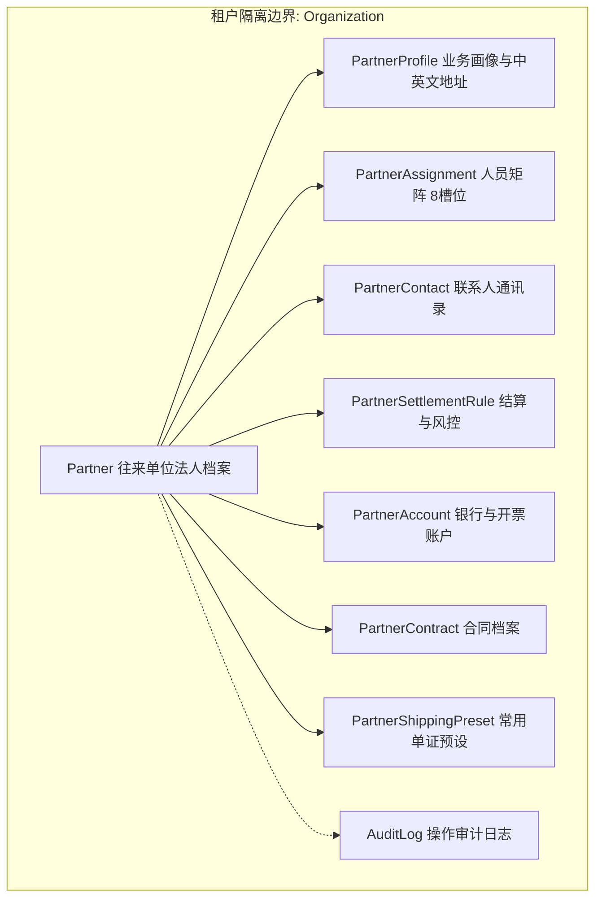

# 客户档案全景页面重构与后端设计方案

## 1. 背景与目标

为了提供更高效、直观的货代客户档案管理体验，参考成熟竞品的设计形态，将当前 `roncin-go-admin` 客户详情/编辑页面从“抽屉分散维护模式”升级为**“一体化全景卡片折叠流（Accordion）”**。

在同一页面中集中聚合客户的基础档案、财务结算、银行账户、联系人通讯录、货代常用单证预设、合同档案、客户备注及操作审计日志 8 大核心业务板块。

---

## 2. 页面模块与交互全景规划

```
+-----------------------------------------------------------------------------------+
| [返回列表]  客户管理 / 成都蓉铁盛达供应链管理有限公司 [CDRT]          [取消] [保存客户档案] |
+-----------------------------------------------------------------------------------+
| ∨ 基础信息                                                                         |
|   - 公司抬头 (必填) | 社会统一信用代码 (带校验按钮) | 单位编码 (简码)                         |
|   - 中文地址 (省/市/区 联动级联 + 详细地址)                                            |
|   - 英文名称 (整行输入)                                                             |
|   - 英文地址 (整行输入)                                                             |
|   - 性质: [客户] | 类型: [☑ 直客  ☐ 同行] | 开发方式: [下拉] | 业务类型: [下拉]               |
|   - 人员分配矩阵 (4行 × 2列 = 8个责任槽位, 每个槽位包含 [人员下拉] + [所属分支机构下拉]): |
|     * 创建人员: [刘霁菲 - 融迅北京]       * 操作人员: [贾鸿鹰 - 融迅成都]                  |
|     * 业务人员: [兰远宁 - 融迅成都]       * 客服人员: [请选择 - 请选择]                    |
|     * 关联人员1: [请选择 - 请选择]       * 单证人员: [请选择 - 请选择]                    |
|     * 商务人员: [请选择 - 请选择]        * 关联人员2: [请选择 - 请选择]                   |
|   - 公司别名: [输入框 + 添加标签]                                                    |
+-----------------------------------------------------------------------------------+
| ∨ 结算信息                                                                         |
|   - 对账方式: [单票对账/汇总对账]    - 结算方式: [票结/月结/周结等]                          |
|   - 结算日期: 每月 [日]             - 账期: [开票后/出运后] [天数] 天                     |
|   - 信用额度 (本币): [输入框]       - 结算币种: [CNY/USD等]    - 利息规则: [编辑规则入口]    |
+-----------------------------------------------------------------------------------+
| ∨ 账户信息 (内嵌卡片区)                                                             |
|   +-----------------------+  +-----------------------+  +-----------------------+  |
|   | 发票抬头: 成都蓉铁盛达... |  | 发票抬头: 香港分公司...   |  |        +              |  |
|   | 税号: 91510108MAKB... |  | 税号: 88291029...     |  |     添加账户          |  |
|   | 账号: 44022390...     |  | 账号: 01289123...     |  |   (点击弹窗录入)       |  |
|   | [编辑] [删除] [默认标记] |  | [编辑] [删除]          |  +-----------------------+  |
|   +-----------------------+  +-----------------------+                             |
+-----------------------------------------------------------------------------------+
| ∨ 联系方式 (内嵌卡片区)                                                             |
|   +-----------------------+  +-----------------------+  +-----------------------+  |
|   | 张三 (操作主管) [主]   |  | 李四 (财务总监)        |  |        +              |  |
|   | 电话: 13800000000     |  | 电话: 13900000000     |  |    添加联系方式        |  |
|   | 邮箱: zhang@corp.com  |  | 邮箱: li@corp.com     |  |   (点击弹窗录入)       |  |
|   +-----------------------+  +-----------------------+  +-----------------------+  |
+-----------------------------------------------------------------------------------+
| ∨ 常用信息 (货代单证高频主数据预设)                                                 |
|   [+ 添加发货人 (Shipper)]       [+ 添加收货人 (Consignee)]    [+ 添加通知人 (Notify)] |
|   [+ 添加英文品名 (Cargo Desc)]  [+ 添加HS编码 (HS Code)]     [+ 添加唛头 (Marks)]    |
+-----------------------------------------------------------------------------------+
| ∨ 合同管理 (内嵌卡片区)                                                             |
|   +-----------------------+  +-----------------------+                             |
|   | 合同: 2026年度海运代理合同 |  |        +              |                             |
|   | 编号: CT-2026-0089    |  |     添加合同          |                             |
|   | 状态: [生效中]         |  |   (点击弹窗录入)       |                             |
|   | 有效期: 2026-01 ~ 12  |  +-----------------------+                             |
|   +-----------------------+                                                        |
+-----------------------------------------------------------------------------------+
| ∨ 客户备注                                                                         |
|   [ 文本输入框: 录入客户特殊背景、出货偏好与操作协议说明...                          ] |
+-----------------------------------------------------------------------------------+
| ∨ 操作记录 (审计追踪)                                                              |
|   [ 2026-08-22 10:30:15 | 张三 (业务部) | 创建了客户档案                           ] |
|   [ 2026-08-22 11:15:02 | 李四 (财务部) | 更新了结算信息: 信用额度调整为 500,000    ] |
+-----------------------------------------------------------------------------------+
```

---

## 3. 后端架构与数据模型设计

遵循系统分层原则（Kratos + Ent + PostgreSQL + Protobuf）：
* `server/api/partner/v1/partner.proto` 为契约唯一源；
* `server/internal/data/ent/schema/` 为持久化 Schema；
* `server/internal/biz/` 维护纯 Go 领域模型与业务规则；
* `server/internal/service/` 处理 DTO 转换与接口响应。

### 3.1 实体聚合关系



### 3.2 数据库 Schema 调整与扩展

#### 1. 人员分配矩阵扩展 (`PartnerAssignment`)
* 扩充角色枚举至 8 类：
  `CREATOR`（创建人员）、`OPERATOR`（操作人员）、`SALES`（业务人员）、`CUSTOMER_SERVICE`（客服人员）、`DOCUMENT`（单证人员）、`COMMERCIAL`（商务人员）、`INTERNAL_CONTACT`（关联人员1）、`INTERNAL_CONTACT_2`（关联人员2）。
* 每条记录同时保存 `user_id` 和 `organization_id`（所属分支机构）。

#### 2. 结算与风控规则扩展 (`PartnerSettlementRule`)
* 字段维护：
  * `statement_mode`: 单票对账 (`single`) / 汇总对账 (`multi`)
  * `settlement_method`: 票结 / 月结 / 周结 / 半月结 / 双月结 / 季结 / 45天 / 预付
  * `settlement_base`: 账单日 (`bill_date`) / 开航日 (`sailing_date`) / 到港日 (`arrival_date`)
  * `settlement_day`: 结算日（每月 1~31 日）
  * `settlement_cycle_days`: 账期天数
  * `settlement_currency`: 结算币种（如 CNY、USD）
  * `credit_limit_minor`: 信用额度（分）
  * `credit_currency`: 信用额度币种
  * `overdue_interest_rate_bp`: 逾期利率（万分比/日）
  * `interest_grace_days`: 利息宽限期天数

#### 3. 货代常用单证预设表设计 (`PartnerShippingPreset`) —— 新增 🔥
用于满足货代业务中客户固定的发货人、收货人、通知人、品名、HS Code 及唛头预置信息：
```go
// server/internal/data/ent/schema/partner_shipping_preset.go
package schema

import (
	"entgo.io/ent"
	"entgo.io/ent/schema/edge"
	"entgo.io/ent/schema/field"
	"entgo.io/ent/schema/index"
	"github.com/google/uuid"
)

type PartnerShippingPreset struct {
	ent.Schema
}

func (PartnerShippingPreset) Mixin() []ent.Mixin {
	return []ent.Mixin{IDMixin{}, TimeMixin{}}
}

func (PartnerShippingPreset) Fields() []ent.Field {
	return []ent.Field{
		field.UUID("partner_id", uuid.Nil),
		field.Enum("preset_type").Values(
			"SHIPPER",       // 发货人
			"CONSIGNEE",     // 收货人
			"NOTIFY_PARTY",  // 通知人
			"CARGO_NAME_EN", // 英文品名
			"HS_CODE",       // 海关HS编码
			"SHIPPING_MARK", // 唛头
		),
		field.String("title").NotEmpty().MaxLen(200),        // 抬头名称/简称
		field.Text("content").NotEmpty(),                    // 详细内容/多行单证文本
		field.String("code").Optional().MaxLen(64),         // 补充编码 (如 HS Code)
		field.Bool("is_default").Default(false),             // 是否该类别默认
		field.Int("sort_order").Default(0),                  // 排序权重
		field.String("remark").Optional().MaxLen(500),       // 备注
	}
}

func (PartnerShippingPreset) Edges() []ent.Edge {
	return []ent.Edge{
		edge.From("partner", Partner.Type).
			Ref("shipping_presets").
			Field("partner_id").
			Unique().
			Required(),
	}
}

func (PartnerShippingPreset) Indexes() []ent.Index {
	return []ent.Index{
		index.Fields("partner_id", "preset_type"),
		index.Fields("partner_id", "preset_type", "is_default"),
	}
}
```

---

### 3.3 Protobuf 接口契约定义 (`partner.proto`)

```protobuf
syntax = "proto3";

package partner.v1;

service PartnerService {
  // 1. 往来单位基础档案
  rpc GetPartner(GetPartnerRequest) returns (PartnerReply);
  rpc CreatePartner(CreatePartnerRequest) returns (PartnerReply);
  rpc UpdatePartner(UpdatePartnerRequest) returns (PartnerReply);
  rpc ListPartners(ListPartnersRequest) returns (PartnerListReply);

  // 2. 银行与开票账户管理 (内嵌卡片交互)
  rpc ListPartnerAccounts(ListPartnerAccountsRequest) returns (PartnerAccountListReply);
  rpc CreatePartnerAccount(CreatePartnerAccountRequest) returns (PartnerAccountReply);
  rpc UpdatePartnerAccount(UpdatePartnerAccountRequest) returns (PartnerAccountReply);
  rpc DeletePartnerAccount(DeletePartnerAccountRequest) returns (PartnerAccountDeleteReply);

  // 3. 常用单证预设 (发货人/收货人/通知人/品名/HS/唛头)
  rpc ListPartnerShippingPresets(ListPartnerShippingPresetsRequest) returns (PartnerShippingPresetListReply);
  rpc CreatePartnerShippingPreset(CreatePartnerShippingPresetRequest) returns (PartnerShippingPresetReply);
  rpc UpdatePartnerShippingPreset(UpdatePartnerShippingPresetRequest) returns (PartnerShippingPresetReply);
  rpc DeletePartnerShippingPreset(DeletePartnerShippingPresetRequest) returns (PartnerShippingPresetDeleteReply);

  // 4. 合同管理 (内嵌卡片交互)
  rpc ListPartnerContracts(ListPartnerContractsRequest) returns (PartnerContractListReply);
  rpc CreatePartnerContract(CreatePartnerContractRequest) returns (PartnerContractReply);
  rpc UpdatePartnerContract(UpdatePartnerContractRequest) returns (PartnerContractReply);
  rpc DeletePartnerContract(DeletePartnerContractRequest) returns (PartnerContractDeleteReply);

  // 5. 结算与风控规则
  rpc ListPartnerSettlementRules(ListPartnerSettlementRulesRequest) returns (PartnerSettlementRuleListReply);
  rpc CreatePartnerSettlementRule(CreatePartnerSettlementRuleRequest) returns (PartnerSettlementRuleReply);
  rpc UpdatePartnerSettlementRule(UpdatePartnerSettlementRuleRequest) returns (PartnerSettlementRuleReply);

  // 6. 操作记录审计流水
  rpc ListPartnerAuditLogs(ListPartnerAuditLogsRequest) returns (PartnerAuditLogListReply);
}
```

---

## 4. 实施阶段与排期规划

### 阶段一：契约定义与数据模型演进 (Backend Model & Proto)
1. 在 `partner.proto` 中定义 `PartnerShippingPreset`、利息规则字段及操作日志查询接口；
2. 新增 `partner_shipping_preset.go` Schema，扩充 `PartnerAssignment` 枚举与 `PartnerSettlementRule` 字段；
3. 执行 `go generate` 与 `make api`，生成 Ent ORM 和 gRPC/HTTP 传输代码。

### 阶段二：后端业务逻辑与持久化实现 (Biz & Data Layer)
1. 编写 `internal/biz/partner_shipping_preset.go` 及对应单元测试；
2. 编写 `internal/data/partner_shipping_preset.go` 仓储实现；
3. 在 `internal/service/partner.go` 中挂载常用预设、账户删除、合同删除与审计日志查询端点；
4. 补充 Biz 层的防重校验、默认项互斥及操作变更日志（Audit Diff）记录。

### 阶段三：前端 SDK 生成与页面全景重构 (Frontend UI & Interaction)
1. 运行 `pnpm run generate:web-client` 同步最新的 TypeScript 类型与 API 函数；
2. 重构 `partner-detail.tsx`：
   - 顶部面包屑与悬浮保存条；
   - 基础信息：对齐 8 槽位人员分配矩阵（人员 + 分支机构）及标签化别名；
   - 结算信息：支持信用额度与利息规则；
   - 账户信息：主页内嵌卡片网格 + 快捷弹窗新增/编辑/删除；
   - 联系方式：主页内嵌卡片网格 + 快捷弹窗新增/编辑/删除；
   - 常用信息：6 大货代常用主数据卡片列表与快速录入；
   - 合同管理：主页内嵌卡片网格 + 快捷弹窗新增/编辑/删除；
   - 操作记录：底部时间线与变更流水展示。

### 阶段四：联调与全链路验证 (Testing & Verification)
1. 执行 `pnpm run check:server` 与 `pnpm run check:web`；
2. 针对新建客户、编辑客户、子模块独立维护及审计流水进行联调测试；
3. 验证同域部署与权限控制清单。
